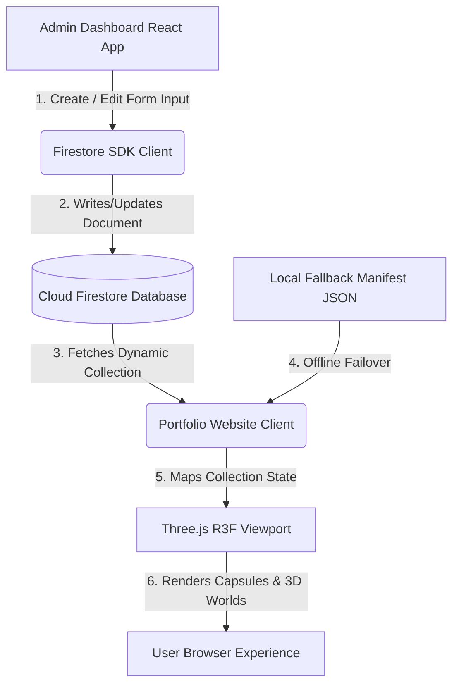

# Data Flow Architecture (CMS Synchronization)

This document describes the dynamic, real-time data flow pipeline between the administrative CMS dashboard, Google Cloud Firestore, and the 3D client portfolio viewport.

## Architecture Diagram

---

## 1. CMS Editor Layer (Write Pipeline)

- **Source:** `/admin-dashboard/pages/` managers (e.g. `ProjectsManager`).
- **Operation:**
  1. Administrative user logs in securely using Firebase Authentication.
  2. Submits a form payload representing item fields (e.g., project details, display order, flags).
  3. Form uploads related media files (PDF resumes, image thumbnails, diagram graphics, demo videos) directly to **Firebase Storage** via `StorageService`.
  4. Returns public storage download URLs and merges them with the text fields.
  5. The client dispatches a `setDoc` or `updateDoc` payload to the Firestore database.

---

## 2. Cloud Database Layer (Storage & Security)

- **Firestore Database:** Houses data inside individual document keys under collections:
  - `projects`
  - `experiences`
  - `skills`
  - `education`
  - `certifications`
  - `contact`
- **Security Rules (`firestore.rules` & `storage.rules`):**
  - **Public Reads (`allow read: if true`):** Allows any client browser to query documents to render the portfolio.
  - **Admin Writes (`allow write: if request.auth != null`):** Restricts creating, modifying, or deleting entries exclusively to authenticated admin sessions.

---

## 3. Client Viewport Layer (Read Pipeline & Fallback)

- **Source:** React/R3F Components (e.g. `ProjectPocket`).
- **Operation:**
  1. The client component initializes its state with hardcoded local manifest data (e.g., `projectManifest`). This serves as the instant-render **Offline Fallback**.
  2. Runs an asynchronous `useEffect` hook on mount, dispatching a query to the database (`ProjectsService.getAll()`).
  3. If the query succeeds, the state is updated, dynamically updating the floating 3D capsules and interactive elements.
  4. If the query fails (e.g., offline user, blocked connections, network errors), the database error is caught silently, and the portfolio continues to function using the local JSON manifests.
