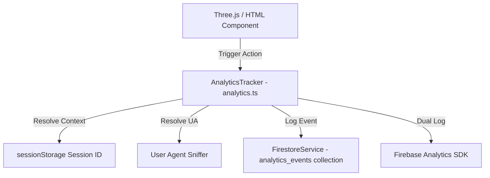

# Analytics Architecture Spec

This document details the telemetry pipeline and event collection system deployed to monitor user and recruiter engagement across the portfolio.

---

## 1. Database Schema (`analytics_events`)

Each interaction creates a single document inside the Firestore `analytics_events` collection matching this interface:

```typescript
export interface AnalyticsEvent {
  id?: string;
  eventType: PortfolioEventType;
  entityId: string;
  timestamp: unknown; // serverTimestamp()
  sessionId: string; // Persistent browser-session uuid
  deviceType: "desktop" | "mobile" | "tablet" | "unknown";
  referrer: string; // document.referrer
}
```

---

## 2. Tracked Events

| Event Type | Triggers When | Captured `entityId` |
|---|---|---|
| `project_view` | User opens a project details HUD panel | Project Name (e.g. `Neura Sentinel`) |
| `project_world_enter` | User enters the 3D world exhibition for a project | Project Name (e.g. `Neura Sentinel`) |
| `project_world_exit` | User exits the 3D world back to the projects pocket | Project Name (e.g. `Neura Sentinel`) |
| `experience_view` | User clicks an experience capsule to open narrative HUD details | Company Name (e.g. `MindMatrix`) |
| `experience_world_enter`| User enters the 3D workspace for an experience | Company Name (e.g. `MindMatrix`) |
| `skill_open` | User clicks a skills category planet | Category Name (e.g. `AI & ML`) |
| `certificate_open` | User clicks a certification sheet inside binder | Certificate Title |
| `contact_open` | User navigates into any app on the handheld tablet | Tab / App name (e.g. `Email`, `GitHub`) |
| `github_click` | User clicks out to a repository or full profile | Repo name or `"profile"` |
| `linkedin_click` | User clicks out to connect on LinkedIn | `"profile"` |
| `resume_download` | User triggers a download of the PDF resume | `"pdf"` |
| `email_click` | User submits the contact form or hits send email | Email channel address / `"contact-form"` |

---

## 3. Telemetry Pipeline Architecture



### A. Session Persistence
- Browser sessions generate a random unique session token stored in `sessionStorage` (e.g. `session_a1b2c3d4_...`).
- This persists across browser refreshes and page routes while keeping user identity anonymous.

### B. Device Detection
- Custom regex user agent classification dynamically maps devices into `"mobile"`, `"tablet"`, or `"desktop"` buckets.

### C. Client Instrumentation
1. **Centralized Hooks**: Centralized `useEffect` listeners inside `IntroScene.tsx` monitor state variables (`selectedProject`, `selectedExperience`, `selectedPlanet`, `selectedCert`, `activeTab`) and trigger logging immediately upon transition.
2. **Explicit Actions**: HUD overlay links and form submits (`ContactPortal.tsx`) bind to specific button `onClick` / `onSubmit` callbacks.
